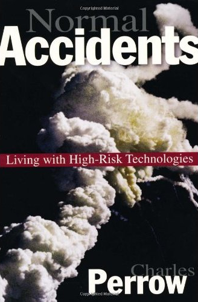
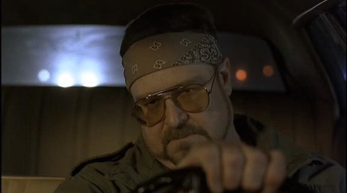
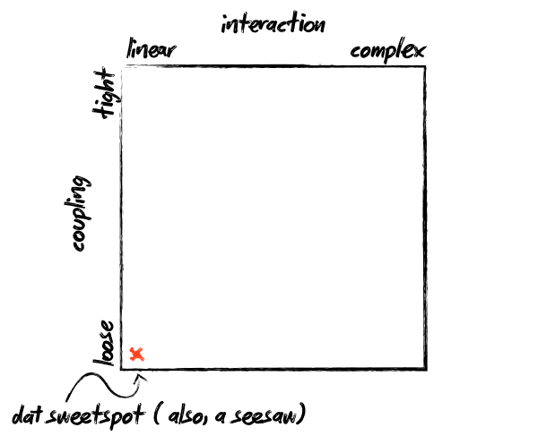
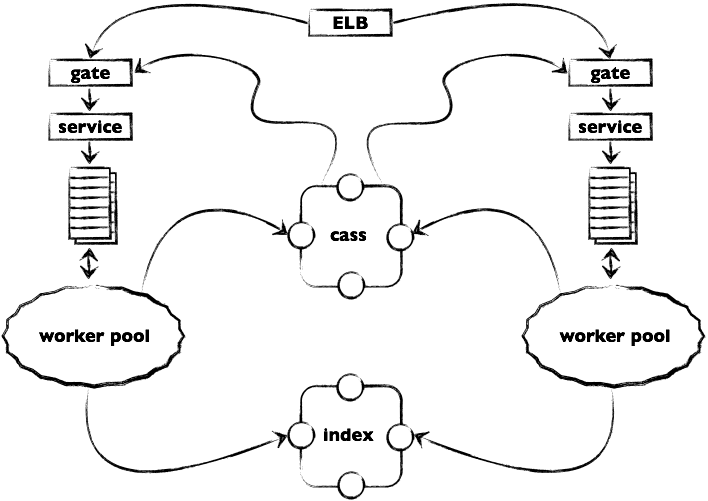

<!SLIDE title-slide>

# Building a cloud service on a cloud infrastructure at

# Also, cloud.

Mikhail Panchenko, Surge 2011
<!SLIDE bullets>

# Who am I?
* 
  * Pancakes
  * Infrastructure Engineer at SimpleGeo
  * Backend Engineer at Flickr before that
  * Backend and Frontend Engineer at Yahoo! Ops/Tools before that
  * Philosophy, Economics, and French major before that

* ____ 
  * @mihasya
  * pancakes@simplegeo.com

<!SLIDE bullets>

* 
  * **TODO** tidy this up
  * Tools for developers
  * Primarily focused on services, some data-oriented APIs
  * PaaS? \*aaS, who gives a @%$#
  * Availability, redundancy part of brand
  * No pressure
<!SLIDE fixed-top>

# Agenda
* Goals
* A little bit of theory
* Challenges in The Cloud
* Architecture
* Stories

<!SLIDE>

# Architectural Goals
* High availability
* Linear scalability
* Elasticity
* Redundancy/Fault Tolerance

<!SLIDE>

# Sound Familiar?

<!SLIDE>

# Some Theory, Food for Thought

<!SLIDE>

# The Internets as Complex Systems

<!SLIDE>

<small><a href="http://www.amazon.com/Normal-Accidents-Living-High-Risk-Technologies/dp/0691004129">http://www.amazon.com/Normal-Accidents-Living-High-Risk-Technologies/dp/0691004129</a></small>

<!SLIDE quotation>

"__Complex interactions__ are those of unfamiliar sequences, or unplanned and unexpected sequences, and either not visible or not immediately comprehensible." 

Charles Perrow. Normal Accidents: Living with High-Risk Technologies (p. 78). Kindle Edition.

<!SLIDE quotation>

"The notion of **baffling interactions** is increasingly familiar to all of us. It characterizes our social and political world as well as our technological and industrial world. As systems grow in size and in the number of diverse functions they serve, and are built to function in ever more hostile environments, increasing their ties to other systems, they experience more and more incomprehensible or unexpected interactions. They become more vulnerable to unavoidable system accidents."

Charles Perrow. Normal Accidents: Living with High-Risk Technologies (p. 72). Kindle Edition.

<!SLIDE>

# Fortunately,  This Is Only The Internet

<!SLIDE quotation>

"The beauty of this is its simplicity. Once a plan gets too complex, everything can go wrong."

Walter Sobchak, <em>The Big Lebowski</em>

<!SLIDE>

# Interactions

# Linear vs Complex

<!SLIDE>

# Coupling

# Tight vs Loose

<!SLIDE>

<!SLIDE quotation>

"Since they assumed a pipe break somewhere and since the piping system in the plant is so complex that [...], there was reason to believe that the water could have come from any number of places. Indeed, later in the accident, they found that **radioactive water was not traveling to the tank they intended, but because of complex flow and pressure interactions, was going to a different, wrong tank**, which also overflowed, this time in the auxiliary building." 

Charles Perrow. Normal Accidents: Living with High-Risk Technologies (pp. 22-23). Kindle Edition.

<!SLIDE quotation>

"**The traffic shift was executed incorrectly and rather than routing the traffic to the other router on the primary network, the traffic was routed onto the lower capacity redundant EBS network.** [...] Unlike a normal network interruption, this change disconnected both the primary and secondary network simultaneously, leaving the affected nodes completely isolated from one another."

"Summary of the Amazon EC2 and Amazon RDS Service Disruption in the US East Region"
    <a href="http://aws.amazon.com/message/65648/">http://aws.amazon.com/message/65648/</a>

<!SLIDE>

# Common Theme

<big>Previously independent systems become coupled as a result of **unanticipated interactions**, leading to **fundamentally surprising** results</big>

<!SLIDE>

# When pumping radioactive water into the wrong tank, the behavior of the program is undefined

<!SLIDE>

# But where does The Cloud come in??

<!SLIDE>

# The Trifle Metaphor

<small>Photo by <a href="http://www.flickr.com/photos/mathematically_impossible/4682284936/">mathematically_impossible</a></small>

<!SLIDE>

# The Trifle Metaphor

<small>Photo by <a href="http://www.flickr.com/photos/mathematically_impossible/4682284936/">mathematically_impossible</a></small>

<!SLIDE>

# A complex system consisting of complex subsystems

<!SLIDE>

<small>Photo by <a href="http://www.flickr.com/photos/wwarby/2499825928/">wwarby</a></small>

<!SLIDE>

# The Trifle Metaphor

<small>Original photos by <a href="http://www.flickr.com/photos/mathematically_impossible/4682284936/">mathematically_impossible</a> and <a href="http://www.flickr.com/photos/miheco/2243228206/">miheco</a></small>

<!SLIDE>

# Tightly coupled to a complex system over which you have no control

<!SLIDE>

# The Trifle Metaphor

<small>Original photos by <a href="http://www.flickr.com/photos/mathematically_impossible/4682284936/">mathematically_impossible</a> and <a href="http://www.flickr.com/photos/miheco/2243228206/">miheco</a></small>

<!SLIDE>

# Recall   "Baffling Interactions"

<!SLIDE quotation>

"The notion of **baffling interactions** is increasingly familiar to all of us. It characterizes our social and political world as well as our technological and industrial world. As systems grow in size and in the number of diverse functions they serve, and are built to function in **ever more hostile environments**, increasing their ties to other systems, they experience more and more incomprehensible or unexpected interactions. They become more vulnerable to unavoidable system accidents."

Charles Perrow. Normal Accidents: Living with High-Risk Technologies (p. 72). Kindle Edition.

<!SLIDE>

# DECOUPLE DECOUPLE DECOUPLE

### (introduce the architectural choices of software as they relate to all that)

<!SLIDE>

# Partition Tolerance

## It's not just for outages

<!SLIDE>

# Config Management

### Decouple from where you're deploying

### (see http://aws.amazon.com/directconnect/)

<!SLIDE>

# The Birds 'n' the Bees

<!SLIDE fixed-top>
# Write Path

<!SLIDE fixed-top>
# Cassandra
  * Homogenous distributed model
  * Random load distribution
  * A mostly-textbook DHT
  * Generally well understood by developers
  * A perfect foundation for our architecture (we'll get back to this)

<!SLIDE fixed-top>
# RabbitMQ
  * A grenade for our knife-fight
  * Very flexible - more than we need
  * 2.x bulletproof - no stability issues
  * Disk persistor - degradation over failure
  * See talk at 1:30PM

<!SLIDE>

# Put it all together
