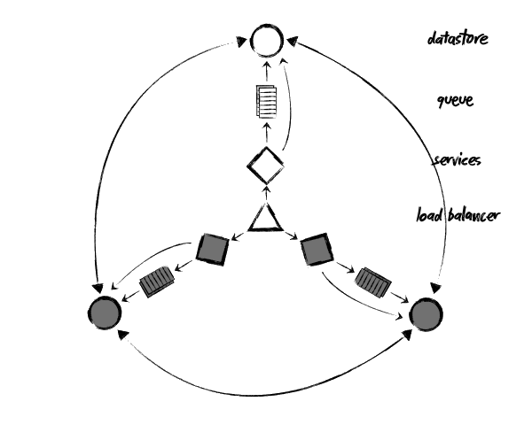
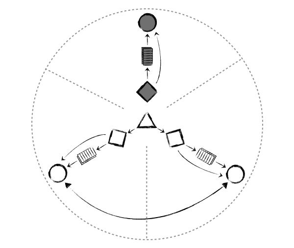
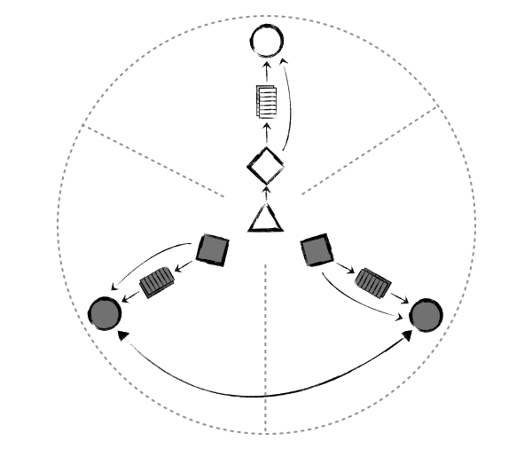

<!SLIDE title-slide>

# Building a cloud service on a cloud infrastructure at

# Also, cloud.

Mikhail Panchenko, Surge 2011
<!SLIDE bullets>

# Who Am I?
* 
  * Pancakes
  * Infrastructure Engineer at SimpleGeo
  * Backend Engineer at Flickr before that
  * Backend and Frontend Engineer at Yahoo! Ops/Tools before that
  * Philosophy, Economics, and French major before that

* ____ 
  * @mihasya
  * pancakes@simplegeo.com

<!SLIDE bullets>

* 
  * **TODO** tidy this up
  * Tools for developers
  * Primarily focused on services, some data-oriented APIs
  * PaaS? \*aaS, who gives a @%$#
  * Availability, redundancy part of brand
  * No pressure
<!SLIDE fixed-top>

# Agenda
* Goals
* A little bit of theory
* Challenges in The Cloud
* Architecture
* Stories

<!SLIDE>
.notes Note on elasticity - this isn't just about outages

# Architectural Goals
* High availability
* Linear scalability
* Elasticity/Flexibility
* Redundancy/Fault Tolerance

<!SLIDE>

# Sound Familiar?

<!SLIDE>
.notes this talk isn't solely about the cloud, cloud adds challenges to universal problems

# Some Theory, Food for Thought

<!SLIDE>

# The Internets as Complex Systems

<!SLIDE>

<small><a href="http://www.amazon.com/Normal-Accidents-Living-High-Risk-Technologies/dp/0691004129">http://www.amazon.com/Normal-Accidents-Living-High-Risk-Technologies/dp/0691004129</a></small>

<!SLIDE quotation>

"__Complex interactions__ are those of unfamiliar sequences, or unplanned and unexpected sequences, and either **not visible** or **not immediately comprehensible**." 

Charles Perrow. Normal Accidents: Living with High-Risk Technologies (p. 78). Kindle Edition.

<!SLIDE quotation>

"The notion of **baffling interactions** is increasingly familiar to all of us. [...] As systems grow in size and in the number of diverse functions they serve, and are built to function in ever more hostile environments, increasing their ties to other systems, they experience more and more incomprehensible or unexpected interactions. They become more vulnerable to unavoidable system accidents."

Charles Perrow. Normal Accidents: Living with High-Risk Technologies (p. 72). Kindle Edition.

<!SLIDE>

# Fortunately,  This Is Only The Internet

<!SLIDE quotation>

"The beauty of this is its simplicity. Once a plan gets too complex, everything can go wrong."

Walter Sobchak, <em>The Big Lebowski</em>

<!SLIDE>

# Interactions

# Linear vs Complex

<!SLIDE>

# Coupling

# Tight vs Loose

<!SLIDE>

<!SLIDE quotation>

"Since they assumed a pipe break somewhere and since the piping system in the plant is so complex that [...], there was reason to believe that the water could have come from any number of places. Indeed, later in the accident, they found that **radioactive water was not traveling to the tank they intended, but because of complex flow and pressure interactions, was going to a different, wrong tank**, which also overflowed, this time in the auxiliary building." 

Charles Perrow. Normal Accidents: Living with High-Risk Technologies (pp. 22-23). Kindle Edition.

<!SLIDE quotation>

"**The traffic shift was executed incorrectly and rather than routing the traffic to the other router on the primary network, the traffic was routed onto the lower capacity redundant EBS network.** [...] Unlike a normal network interruption, this change disconnected both the primary and secondary network simultaneously, leaving the affected nodes completely isolated from one another."

"Summary of the Amazon EC2 and Amazon RDS Service Disruption in the US East Region"
    <a href="http://aws.amazon.com/message/65648/">http://aws.amazon.com/message/65648/</a>

<!SLIDE>

# Common Theme

<big>Previously independent systems become coupled as a result of **unanticipated interactions**, leading to **fundamentally surprising** results</big>

<!SLIDE>

# When pumping radioactive water into the wrong tank, the behavior of the program is undefined

<!SLIDE>

# But where does The Cloud come in??

<!SLIDE>
.notes hat tip to Cal Henderson

# The Trifle Analogy

<small>Photo by <a href="http://www.flickr.com/photos/mathematically_impossible/4682284936/">mathematically_impossible</a></small>

<!SLIDE>

# The Trifle Analogy

<small>Photo by <a href="http://www.flickr.com/photos/mathematically_impossible/4682284936/">mathematically_impossible</a></small>

<!SLIDE>

# A complex system consisting of complex subsystems

<!SLIDE>

<small>Photo by <a href="http://www.flickr.com/photos/wwarby/2499825928/">wwarby</a></small>

<!SLIDE>

# The Trifle Analogy

<small>Original photos by <a href="http://www.flickr.com/photos/mathematically_impossible/4682284936/">mathematically_impossible</a> and <a href="http://www.flickr.com/photos/miheco/2243228206/">miheco</a></small>

<!SLIDE>

# Tightly coupled to a complex system over which you have no control and into which you have no insight

<!SLIDE>

<small>Photo by <a href="http://www.flickr.com/photos/20after4/2302676207/">20after4</a></small>

<!SLIDE>

# Recall   "Baffling Interactions"

<!SLIDE quotation>

"The notion of **baffling interactions** is increasingly familiar to all of us. [...] As systems grow in size and in the number of diverse functions they serve, and are built to function in **ever more hostile environments, increasing their ties to other systems,** they experience more and more incomprehensible or unexpected interactions. They become more vulnerable to unavoidable system accidents."

Charles Perrow. Normal Accidents: Living with High-Risk Technologies (p. 72). Kindle Edition.

<!SLIDE>

# DECOUPLE DECOUPLE DECOUPLE ( also, simplify )
<!SLIDE>

<small>Photo by <a href="http://www.flickr.com/photos/erikcharlton/496486975/">erikcharlton</a></small>

<!SLIDE fixed-top>
.notes shared resources - flickr infinite recursion story

# Decouple Your Subsystems

* Shared resources are the most common source of unexpected interaction
* Resist temptation to double up on roles
* Use queues, caches as buffers
  * **NOTE**: those are complex subsystems of their own

<!SLIDE fixed-top>
.notes shared resources - flickr infinite recursion story

# Decouple Your Subsystems

## Explicit Decoupling

* CPU Affinity
  * Webserver on 1-7; SSH etc on 8
  * Crude, but gets the job done
* More robust solutions - containers

<!SLIDE fixed-top>

# Decouple Your Functionality
* Service architecture
* Each service does one thing well
* Easier to measure, understand, and accommodate resource demands
* Reduce potential for interactions, cross-functional failure

<!SLIDE bullets fixed-top>

# Decouple from Your Environment with Configuration Management

*  
    * Decouple from your platform (OS/kernel)
      * Easy to test/bench potential candidates
      * Easy to migrate if you find a winner
      * This is especially important when dealing with cloud
    * Automate as much of deploy/bootstrap process as possible
      * Probably won't help much during a provider outage due to stampede
      * <strong>BUT:</strong> <a href="http://aws.amazon.com/directconnect/">DirectConnect</a>
      * You might not always be in the cloud..

<!SLIDE fixed-top>

# Decouple Your Datacenters
.notes "temporarily disable a datacenter" instead of coming up with elaborate failure strategies

* Most robust redundancy mechanism
* Hot-hot keeps you on your toes
* Simplifies, not just for the cloud
  * Yahoo! now foregoing datacenter features like HVAC
  * "If it gets too hot in Washington, turn that DC off for a while"
  * I'm sure they're not the only ones

<!SLIDE fixed-top>

# Decouple Your Datacenters

* "AZ" - Basic building block for EC2
* This is the level they (theoretically) decouple at
* They are probably thinking along the same lines we are - must be able to turn off one AZ without impact in the other

<!SLIDE>
.notes stampede to the other datacenter if one goes down entirely; also, potential for AWS to fuck up (see EBS/RDS outage) - they are susceptible to all the same problems
# ( there's a hidden interaction there )

<!SLIDE>

# Every datacenter as an independent microcosm of your overall architecture

<!SLIDE>

# The Birds 'n' the Bees

<!SLIDE>

# Bird's Eye View

<!SLIDE>

<small>Photo by <a href="http://www.flickr.com/photos/reschroederimages/4855353883/">reschroederimages</a></small>

<!SLIDE>

# Bird's Eye View

<!SLIDE>

# ( note the absence of specifics )

<!SLIDE>

# Bird's Eye View

<!SLIDE>

# Maintenance - Divide & Conquer

<!SLIDE>

# Local Degradation - Divide & Conquer

<!SLIDE>

# Incompatible Upgrade - Guess!

<!SLIDE>

# Incompatible Upgrade - Guess!

<!SLIDE>

# Incompatible Upgrade - Yay!

<!SLIDE>

# ( now, how about those specifics )

<!SLIDE fixed-top>

# Write Path

<!SLIDE fixed-top>

# ELB

* Dynamic Load Balancing
* Flexible virtual IP
* Easy to add/remove AZs
* Uses healthchecks to automatically evict nodes

<!SLIDE fixed-top>

# Gate - "Layer 8 Proxy"

* Lightweight Node.js daemon
* OAuth
* Rate Limiting
* Basic routing to actual services

<!SLIDE>
# Recall "Decouple Your Functionality"

<!SLIDE fixed-top>

# Services - Pick Your Own Adventure

* Node.js and Python
  * Some people just hate Node.js
* Can be anything, as long as Gate can talk to it
* Highly specialized

<!SLIDE fixed-top>
# RabbitMQ
  * A grenade for our knife-fight
  * Very flexible - more than we need
  * 2.x very stable (1.x was good too)
  * Disk persistor in >= 1.3 - degradation over failure
  * See talk at 1:30PM

<!SLIDE fixed-top>
# Cassandra
  * A mostly-textbook DHT
  * Homogenous distributed model
  * Random load distribution
  * A perfect foundation for our architecture
  * Idempotent writes ideal for queueing
    * Your usecase/mileage may vary

<!SLIDE>

# Partition Tolerance

## It's not just for outages

<!SLIDE>

# Recall  "Divide & Conquer"

<!SLIDE>

<!SLIDE>

# Put it all together
